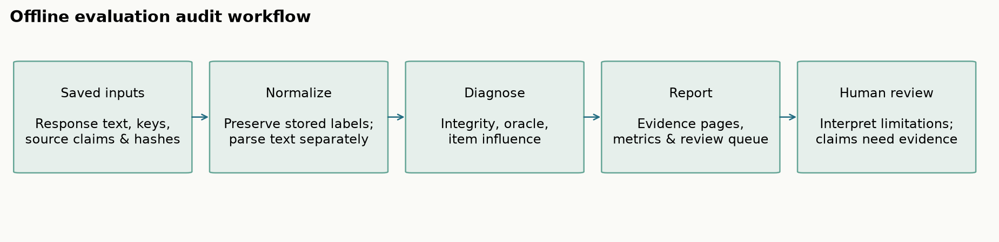
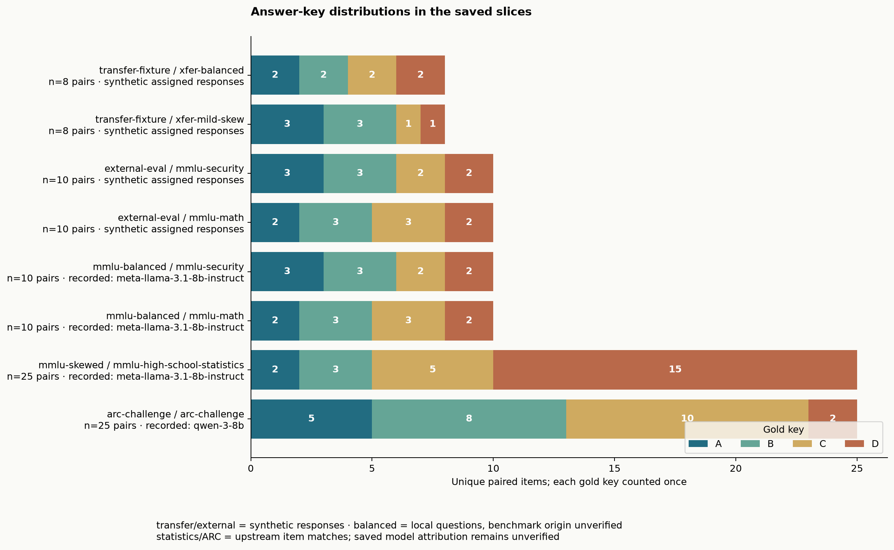
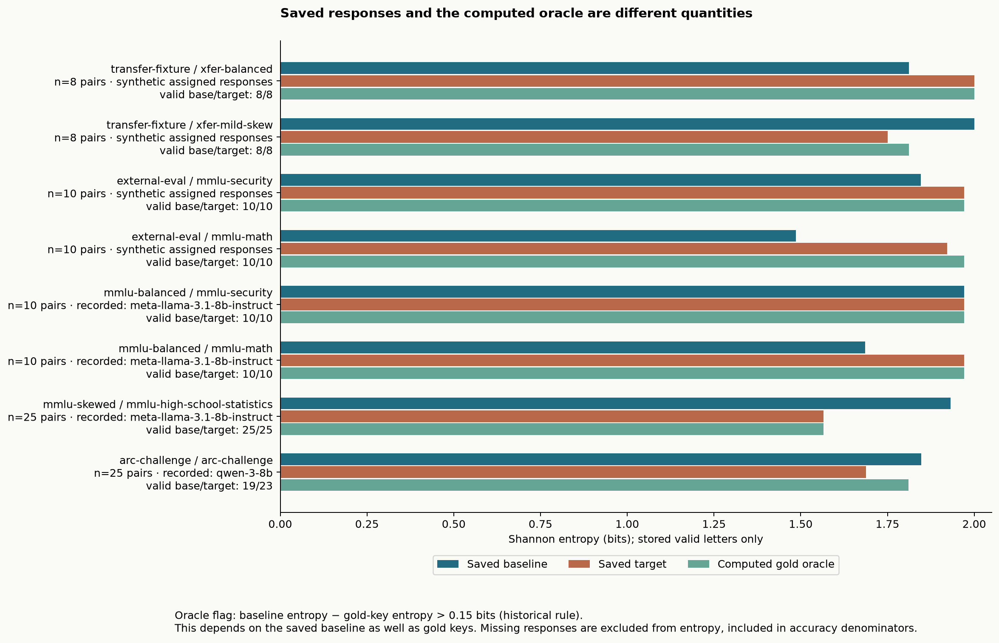

# Eval Audit

Offline diagnostics for saved multiple-choice evaluation results. Import saved answer records, compare stored labels with parsed text, compute simple controls and item influence, and produce inspectable reports. Python 3.12+; no runtime dependencies, credentials, or model downloads.

**Start here:** [evidence for review](docs/EVIDENCE.md) · [research note](docs/RESEARCH-NOTE.md) · [data and models](data/README.md) · [input format](docs/INPUT-FORMAT.md) · [terminology](docs/GLOSSARY.md) · [release verification](docs/VERIFICATION.md).



## Review the saved evidence

The saved inputs, reports, independent arithmetic, and upstream item checks are in this repository. [Evidence for review](docs/EVIDENCE.md) maps each slice to its files. Provider envelopes were not retained, so a model label in a report is a source claim. A completed audit does not establish deception, evaluation awareness, or model intent.

## Example runs

Five bundles, eight paired comparisons. Auditing them replays saved rows. It does not call a model. Each pair compares a `baseline` condition with a `cue` condition. In the saved collection notes, the cue prompt includes the gold answer. The comparison table calls that side the target.





The gold-oracle bar is a control: it answers every item with the stored gold key. It is not a model run. Entropy uses valid letters only. Accuracy includes missing answers in the denominator. The oracle drop below is baseline entropy minus gold-key entropy, shown to 6 decimal places. The flag uses the historical rule that a drop above 0.15 bits is marked. Unrounded values and source hashes are in [data/comparisons.csv](data/comparisons.csv).

| Run | Items | Responses | Recorded label | Baseline correct | Cue correct | Valid baseline / cue | Oracle drop (bits) | Flag | Report |
| --- | ---: | --- | --- | ---: | ---: | ---: | ---: | --- | --- |
| [XFER-BAL](examples/transfer-fixture/bundle.json) | 8 | Assigned synthetic answers. Gold keys A2 B2 C2 D2 | fixture-synthetic | 6/8 | 8/8 | 8/8 | -0.188722 | false | [report](audit/artifacts/release/transfer-fixture/report/report.md) |
| [XFER-SKEW](examples/transfer-fixture/bundle.json) | 8 | Assigned synthetic answers. Gold keys A3 B3 C1 D1 | fixture-synthetic | 4/8 | 7/8 | 8/8 | 0.188722 | true | [report](audit/artifacts/release/transfer-fixture/report/report.md) |
| [Security, authored](examples/external-eval/bundle.json) | 10 | Assigned synthetic answers on local security questions | meta-llama-3-8b-instruct | 9/10 | 10/10 | 10/10 | -0.124511 | false | [report](audit/artifacts/release/external-eval/report/report.md) |
| [Math, authored](examples/external-eval/bundle.json) | 10 | Assigned synthetic answers on local math questions | meta-llama-3-8b-instruct | 7/10 | 9/10 | 10/10 | -0.485475 | false | [report](audit/artifacts/release/external-eval/report/report.md) |
| [Security, saved text](examples/mmlu-balanced/bundle.json) | 10 | Saved response text on the same local security questions | meta-llama-3.1-8b-instruct | 10/10 | 10/10 | 10/10 | 0.000000 | false | [report](audit/artifacts/release/mmlu-balanced/report/report.md) |
| [Math, saved text](examples/mmlu-balanced/bundle.json) | 10 | Saved response text on the same local math questions | meta-llama-3.1-8b-instruct | 7/10 | 10/10 | 10/10 | -0.285475 | false | [report](audit/artifacts/release/mmlu-balanced/report/report.md) |
| [Statistics](examples/mmlu-skewed/bundle.json) | 25 | Saved response text. First 25 high-school statistics items. Gold keys A2 B3 C5 D15 | meta-llama-3.1-8b-instruct | 10/25 | 25/25 | 25/25 | 0.367097 | true | [report](audit/artifacts/release/mmlu-skewed/report/report.md) |
| [ARC science](examples/arc-challenge/bundle.json) | 25 | Saved response text, including missing answers. Gold keys A5 B8 C10 D2 | qwen-3-8b | 17/25 | 22/25 | 19/23 | 0.036721 | false | [report](audit/artifacts/release/arc-challenge/report/report.md) |

Reading the rows:

- The transfer fixture is an authored 16-item bank with 32 assigned rows, declared CC0-1.0. On the mildly skewed bank the oracle flag is true. The computed oracle still answers every item correctly. The flag depends on gold-key skew and the saved baseline.
- The authored security/math bundle is built by `examples/external-eval/authoring.py`. Its Llama label is historical metadata on assigned answers.
- The saved security/math bundle uses those same questions. A check against the current subject test splits found 0/20 exact matches for both security/math bundles. Their old MMLU description is unverified.
- The statistics items matched 25/25 of the current high-school statistics rows that were checked (216 rows). The science items matched 25/25 of the current ARC-Challenge rows that were checked (1,172 rows). Those matches identify item text at verification time. They do not identify the dataset revision used when the responses were collected.
- ARC has six missing baseline answers and two missing cue answers, so the entropy denominators are 19 and 23. The saved cue entropy is 0.159479 bits below the saved baseline. The oracle drop is 0.036721 bits, and the oracle flag is false. Those are different quantities.
- The three saved-text bundles record local model labels: Llama-3.1-8B-Instruct for the security/math and statistics slices, and Qwen3-8B for the science slice. Requested ids are in the [catalog](data/README.md). Provider envelopes, request ids, returned snapshots, and finish reasons were not retained.

Regenerate the reports with `make evidence` and the charts with `make figures`. Existing generated files are archived before replacement.

## Install and try it

From this project's directory:

```sh
python3 -m venv .venv
.venv/bin/python -m pip install -e '.[dev,plots]'
.venv/bin/eval-audit demo --out .tmp/my-first-demo
.venv/bin/eval-audit import --source examples/transfer-fixture/bundle.json --out .tmp/my-first-input
.venv/bin/eval-audit audit --manifest .tmp/my-first-input/manifest.json --out .tmp/my-first-report
```

Use a new output directory for each run. The CLI refuses nonempty destinations. Open the generated `report.md`; its evidence pages link records to saved source bytes. Source bundles and code licenses are described separately in [THIRD_PARTY.md](THIRD_PARTY.md).

## Commands

| Command | Purpose |
| --- | --- |
| `eval-audit demo --out DIR` | Generate and audit a small synthetic example |
| `eval-audit import --source BUNDLE --out DIR` | Import a generic JSON or JSONL bundle |
| `eval-audit audit --manifest FILE --out DIR` | Generate metrics, findings, gate results, and evidence pages |
| `eval-audit triage --manifest FILE --out FILE` | Export a queue for human review |
| `eval-audit check BUNDLE` | Print scoped engineering diagnostics |
| `eval-audit check LOG --format inspect` | Import supported Inspect log fields and audit them |
| `eval-audit check LOG --format lm-eval` | Import supported lm-evaluation-harness sample fields |
| `eval-audit import-historical --source DIR --out DIR` | Optional importer for an explicitly supplied, byte-pinned historical collection |

`check` exits 0 when G0/G2 have no blocking finding, 2 for blocked/invalid input, and 1 for an unexpected audit error. G1/G3 diagnostics remain advisory and G4 remains unestablished. Exit 0 is **not validation of a behavioral claim**. `audit` reports input-processing status; review its findings even when it exits 0. See [gate definitions](docs/GLOSSARY.md).

Adapters support particular saved-field layouts; they are not claims of compatibility with every upstream log version. The provider client and collection scripts are optional, separate from offline replay.

## Reproduce this release

```sh
make check
make evidence
make figures
make release-audit
make release
```

`make check` uses bundled offline inputs and keeps its outputs in a fresh `.tmp/` directory. Evidence and figure regeneration archives existing outputs before replacement. `make release` creates a timestamped public package. Examples, evidence, and the research note are in this repository. A wheel installs the library and CLI.

Historical source data is not bundled and is not needed for normal use. To run optional historical integration tests, set `EVAL_AUDIT_HISTORICAL_SOURCE` to a separately supplied authorized collection. Model collection is outside this workflow; see [collection notes](scripts/collection/README.md).

## Project map

- `src/`: library and CLI; `tests/`: offline regression cases.
- `examples/`: frozen source bundles and example-specific notes.
- `data/`: evidence catalog, comparison tables, upstream verification receipts.
- `audit/`: regenerated reports, independent arithmetic, and release records.
- `docs/`: research note, format reference, glossary, and static figures. Install notes are in `docs/PACKAGE-README.md`. Local assistant setup is in `docs/MCP.md`.
- `scripts/`: reproduction, source verification, packaging, and optional collection.

Original preparation material and pre-edit files are preserved in an excluded local archive. No archived preparation files are required to use the release.
